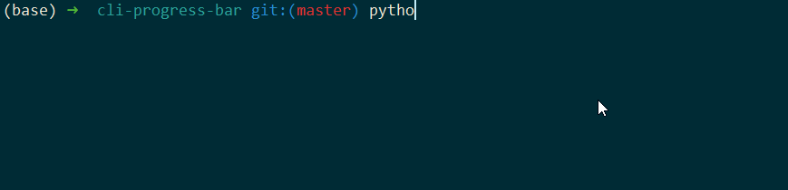
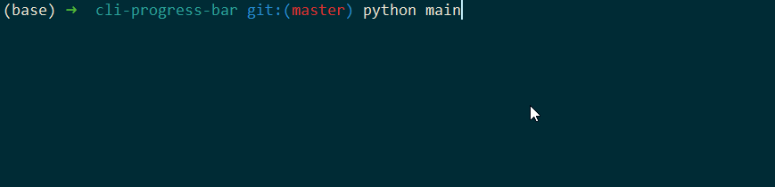
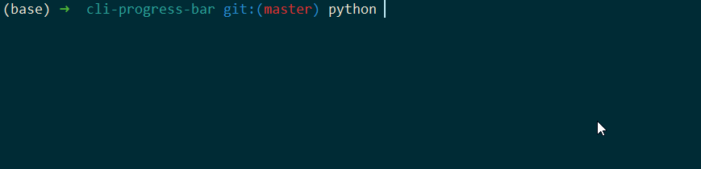

## Simple stdout progress bar

### Usage

```
usage: main.py [-h] {parse,info} ...

positional arguments:
  {parse,info}  Choose a command
    parse       "parse" help
    info        "info"

optional arguments:
  -h, --help    show this help message and exit

```

parse command

```
usage: main.py parse [-h] [--enable_logging] mode

positional arguments:
  mode              parse mode can be one of "basic", "long" or "error"

optional arguments:
  -h, --help        show this help message and exit
  --enable_logging  enable file logging
```

info command

```
usage: main.py info [-h] [-formatter FORMATTER]

optional arguments:
  -h, --help            show this help message and exit
  -formatter FORMATTER  type of progress bar formatter. one of "left" or
                        "dots"
```


### Examples:

```sh
python main.py info -formatter='dots'
python main.py info -formatter='left'
```

```
python main.py parse basic
```


```
python main.py parse long
```


```
python main.py parse error --enable_logging
```
> note: log file with debug info will be generated at log.log



